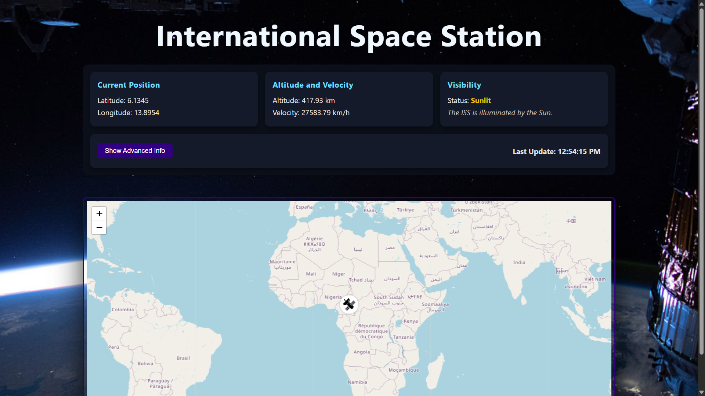
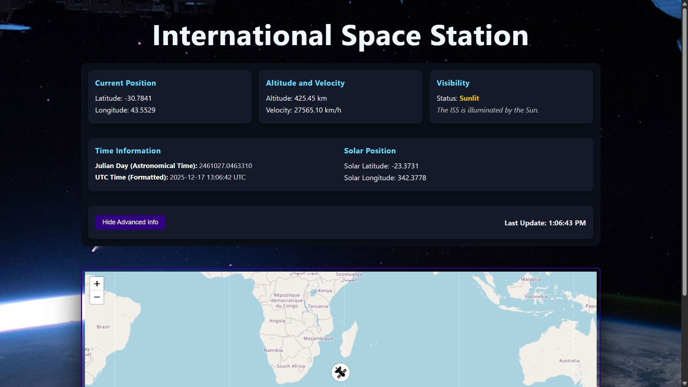
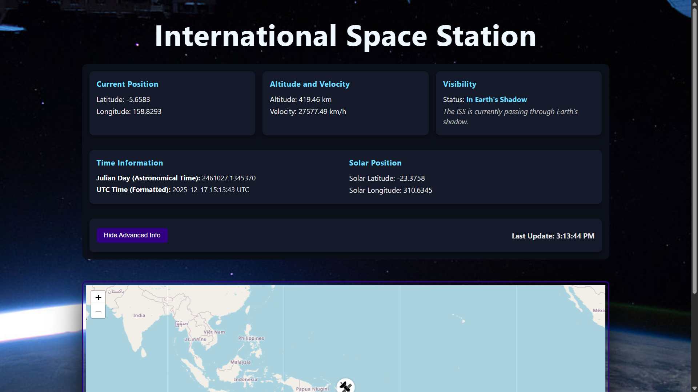

# 🛰️ ISS Live Tracker - v2.0

A React application that displays the real-time location of the International Space Station (ISS) on an interactive map.

The application shows details about the current position based on geographic coordinates, along with additional information such as orbital velocity and lighting status. The lighting status indicates whether the ISS is illuminated by the Sun (potentially visible under good conditions) or passing through Earth’s shadow.

It also includes advanced data such as astronomical time displayed in Julian Day format, used in astronomy, and information about the current solar position.

## API
- https://api.wheretheiss.at/v1/satellites/25544

## Tech Stack
- React 19 (vite)
- TypeScript
- Axios
- Leaflet (live map)

## Screenshots

### 1

## 2

## 3
