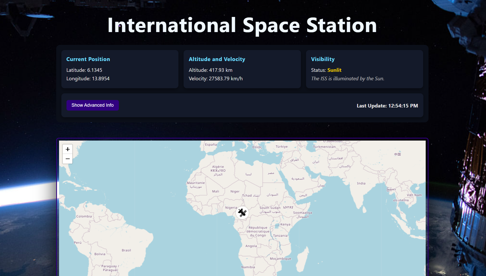

# 🛰️ ISS Live Tracker - v2.0

A React application that displays the real-time location of the International Space Station (ISS) on an interactive map.

**Live Demo**: [View on Vercel](https://iss-20.vercel.app/)



The application shows details about the current position based on geographic coordinates, along with additional information such as orbital velocity and lighting status. The lighting status indicates whether the ISS is illuminated by the Sun (potentially visible from Earth under good conditions) or passing through Earth’s shadow.

It also includes advanced data, such as astronomical time in Julian Day format and information about the current solar position.

## API
 https://api.wheretheiss.at/v1/satellites/25544

## Tech Stack
- React 19 (vite)
- TypeScript
- Axios
- Leaflet (live map)

## Installation & Running the Project

### Prerequisites
- Node.js (v18)
- npm or yarn

### Installation


```bash
Clone the repository:

git clone https://github.com/MikeMikeRx/ISS-2.0.git

cd ISS-2.0

Install dependencies:

npm install

Start the development server:

npm run dev

The application will be available at:

http://localhost:5173
```